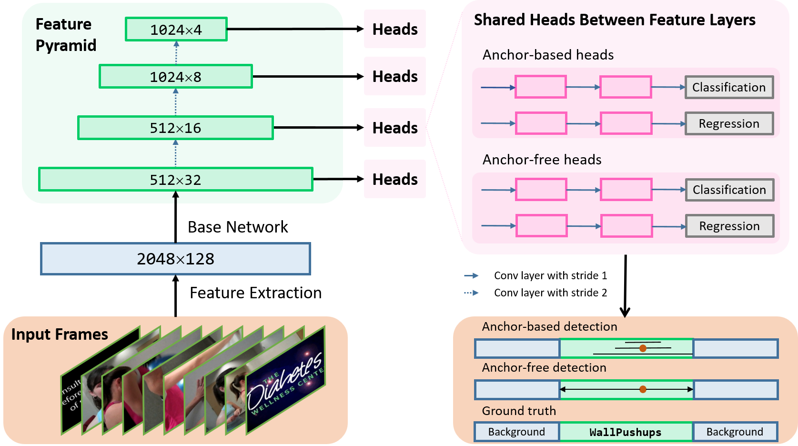

An temporal action detection approach named MSA-Net that combines anchor-based and anchor-free modules.



This repository is an improved version of [A2Net](https://github.com/VividLe/A2Net), the code for anchor-free module references [FCOS](https://github.com/open-mmlab/mmdetection/tree/master/configs/fcos).

If you find the repository helpful to you, here is the anchor-based part [SSAD](https://github.com/blowing-wind/SSAD).

## Result

The detection results on THUMOS14 dataset:

| mAP@ |  0.3  |  0.4  |  0.5  |  0.6  |  0.7  |
| :--: | :---: | :---: | :---: | :---: | :---: |
|      | 62.79 | 58.87 | 51.47 | 38.75 | 24.03 |

## Prerequisites

This repository is implemented with Pytorch 1.1.0 + Python3.

## Download Datasets

The Two stream I3D feature could be downloaded from [A2Net](https://github.com/VividLe/A2Net).

## Training and Testing

1. To train the MSA-Net:

```
cd tools
python main.py
```

The parameters could be modified in 

```
experiments\A2Net_thumos.yaml
```

2. To Test the  MSA-Net:

```
cd tools
python eval.py --checkpoint $cpt_path
```

3. Evaluating the detection performance:

Open Matlab in `lib\Evaluation\THUMOS14_evalkit_20150930` path, and put the testing result file in the path, and execute the file:

```
multi_iou_eval
```

